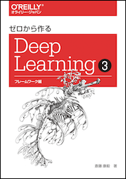

ゼロから作る Deep Learning ❸
==========================

本リポジトリは、オライリー・ジャパン発行書籍『[ゼロから作る Deep Learning ❸](https://www.oreilly.co.jp/books/978487311xxxx/)★』のサポートサイトです。本書籍で使用するソースコードがまとめられています。

## ファイル構成

## Pythonと外部ライブラリ

## 実行方法

## ライセンス

## 正誤表

